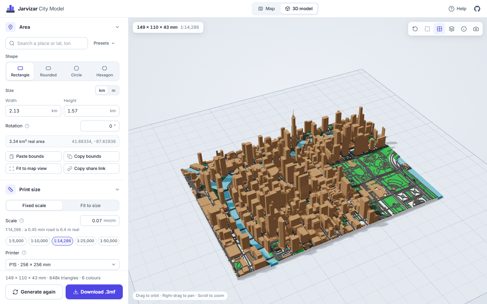
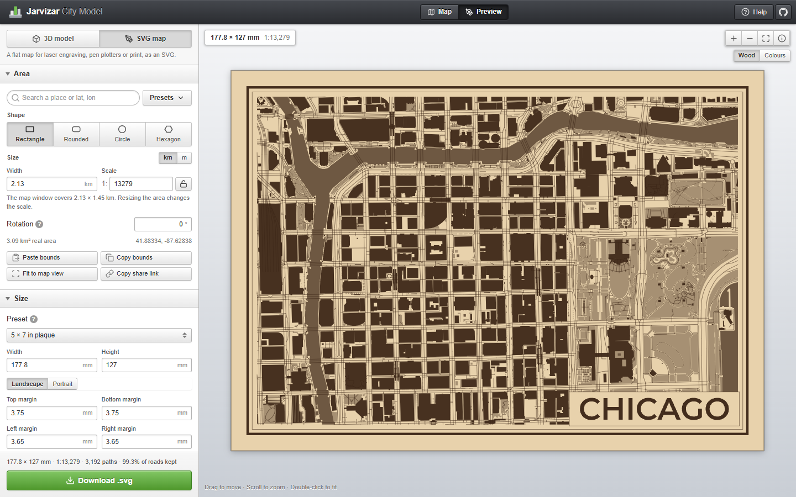

# Jarvizar City Model

Turn any area of the map into a multicolour 3D printable city model, right in your browser. It builds terrain, water, parks, roads and buildings from [Overture Maps](https://overturemaps.org) data and public elevation tiles, optionally measures the buildings from public LiDAR surveys, and sizes it all for FDM printing with a 0.4 mm nozzle, and exports a Bambu Studio project with one filament per colour. It can also build the whole model from a LiDAR survey alone, as one piece in one colour, or make a flat SVG map of the same area for laser engraving, pen plotters and print.

Visit the [GitHub Pages site](https://citymodel.jarvisar.com/) to use the latest version.

This is the web version of my Blender add-on. It runs the same generation rules, ported to TypeScript, so there's nothing to install: no Blender and no Python downloader. The SVG maps come from SVGmap, a separate app I made for laser engraving that's now part of this one.

## How to Use

1. Search for a place, pick one of the `Presets`, or drag the box on the map. Drag a corner to resize it and the round handle to rotate it.
2. Pick `3D model` or `SVG map` at the top of the settings.
3. For a model, pick a shape (rectangle, rounded, circle or hexagon) and check the printed size under `Print size`. The default scale is 0.07 mm per metre, so a 2 km wide area prints 140 mm wide.
4. Turn layers on or off under `Layers`, and pick filament colours under `Colours`. The Bambu PLA Basic and Matte colours are built in. Turn on `LiDAR` to measure buildings from a public survey where one covers the area, or pick `LiDAR only` at the top of `Layers` to build everything from the survey (see below).
5. Click `Generate model`. The map data downloads first, which takes a few seconds for a small area.
6. Look the model over in the 3D view, then click `Download`.

Open the 3MF in Bambu Studio with `File > Open Project`. Every part already has its filament, so check the filaments against what's loaded in your AMS, recalculate the flushing volumes and slice. For other slicers, pick a PrusaSlicer project, a 3MF with colours or an STL zip under `Export`.

`Copy share link` copies a link that opens the same area. For an SVG map it carries the SVG settings too.

`Export options` and `Import options` at the bottom of the settings save and restore a JSON file. Leave `Include map area` checked to restore the whole setup, or uncheck it to reuse the options at another location. Custom font files are separate.

### SVG Maps

Pick the piece under `Size`: a plaque, a sheet of paper, a coaster or your own size. The box on the map becomes the map inside the piece's border, with the margin, border and title drawn around it, and resizing it changes the scale. Lock the scale to keep it while you try other places and sizes.

Click `Generate SVG` to open the preview, which keeps up with the settings while it's open, then `Download .svg`. `Output` switches between a laser (fills engrave, lines score and the edge cuts, one colour per layer), a pen plotter (everything is a stroke, one numbered layer per pen) and print (coloured themes). The file is sized in millimetres, so check the imported size in your laser software.

Two lines closer together than the laser beam burn as one dark band, so `Line cleanup` merges them, like sidewalks next to roads. Set `Line spacing` to about your beam width, or 1.5 to 2 times your pen width. See [SVG maps](docs/SVG_MAPS.md) for more.

### LiDAR Only

`LiDAR only` builds the ground, buildings, trees and bridges from the survey as it saw them, in one closed solid in the `Terrain` colour. Towers, roof shapes, overpasses and park trees come out without depending on how well the city is mapped. `Detail` sets the printed size of one grid cell (0.05 mm, 0.71 m at the default scale), and the cells grow where the survey is too sparse to fill them. Trees are rounded or removed, cars and clutter are flattened, and water is recessed or cut away. It works best on small areas at a large scale, around 1 km printed 150 to 200 mm across.

## Features

- Terrain from public elevation data, with rivers, lakes, the sea and ponds as a thin water layer just below their banks, or cut through the base
- Parks, forest, sand, rock and paving, each as its own colour
- Roads, paths, railways and airport paving, widened where needed so they print with a 0.4 mm nozzle, and tidied so doubled lines and stray scraps of path don't print
- Buildings from mapped heights and building parts, with gabled, hipped, skillion, pyramid and dome roofs
- Optional LiDAR buildings, rebuilt from their scanned roofs with setbacks, towers, domes and spires, from USGS 3DEP, IGN France, NRCan, swisstopo and Open LiDAR Data
- LiDAR only models: the whole area from a survey as one single-colour solid, with water recessed or cut away
- Optional bridges on piers, trees and a border rim
- Crop to a rectangle, rounded rectangle, circle or hexagon, rotated to follow the street grid
- Fixed print scale, or fit the model to a size
- Large models split into sections, one per plate
- Exports a Bambu Studio project, a PrusaSlicer project, a 3MF with colours, or STL files
- Colour presets, including a 4-colour AMS palette and a single-colour one
- SVG maps for laser engravers, pen plotters and print, with a border, a title in one of eleven fonts or your own, and line cleanup made for the beam width
- Runs entirely in the browser, and installs as an app. Downloaded data is cached, so changing a setting regenerates quickly

## Printing Tips

- The defaults are made for a 0.4 mm nozzle and 0.2 mm layers. Roads stand 0.6 mm tall and parks 0.4 mm, whole numbers of layers.
- Every colour is one filament. One AMS holds four, and the `4-Colour AMS` preset stays within that.
- Water prints as a 1 mm layer on a floor of terrain, so its colour only comes in near the top. `Layers > Water > Large water` can cut it through the base instead, from the bed up.
- Most of the model prints without supports. Bridges are the exception, so let the slicer add supports only where it finds them. Building parts mapped to start above the ground are built down to it unless you turn that off.
- A model bigger than your bed can be split with `Multi-plate export`. The sections fit back together with no gaps or connectors.
- For an SVG map, test your laser settings on scrap first. The wood preview is only a rough idea of how the fills burn.

## Install & Offline Use

The site can be installed as an app from the `Install` prompt or the browser's install button. On an iPhone or iPad, tap `Share` and then `Add to Home Screen`. It opens without a connection, and SVG maps of areas you've already looked at can be made again offline, since their tiles are saved (the last 500, for up to 30 days). 3D models and place search need a connection.

When a new version is deployed, a notice asks you to reload. It never reloads on its own.

## Local Installation

1. Install [Node.js](https://nodejs.org) 24 or newer.
2. Clone the repository and run `npm install`.
3. Run `npm run dev` and open the address it prints.

`npm test` runs the unit tests and `npm run build` builds the site into `build/`. See [development](docs/DEVELOPMENT.md) for the command-line tools and how the code is laid out.

Pushing to `main` deploys the site with GitHub Actions. Set `Settings > Pages > Source` to `GitHub Actions` once.

## Known Issues & Limitations

- Large areas take longer and need more memory. Around 25 km² at the default scale is comfortable on a desktop browser. Phones can manage small areas.
- An area that needs more than 300 MB of map data is refused. Make it smaller or pick fewer layers.
- Map data varies by city. Buildings without a mapped height get a typical height for their type, and some places have few mapped buildings.
- Bridges are schematic: decks on evenly spaced piers, without towers, arches or trusses.
- LiDAR is only read from surveys a browser can stream (EPT and COPC). Places only covered by tiled LAZ downloads, like England, most of Germany and Spain, keep their mapped buildings.
- LiDAR downloads are big: 150 to 450 MB per km² depending on the survey. The `Chicago - The Loop (small)` preset reads about 790 MB and takes about 4 minutes the first time, the `Paris - Eiffel Tower` preset about 2.2 GB and 15 minutes. Point data is cached in the browser up to 1 GB, and measured buildings are reused for a day.
- A LiDAR only model shows the city the year it was surveyed. Glass, dark roofs and water return few points, and those spots are filled in from around them. It's 2.5D, so skybridges and elevated tracks are solid down to the ground, and with the water cut away, bridges are solid walls down to the base.
- The model is made of separate overlapping parts, one per colour. Slicers join them, but other tools may report them as intersecting.
- The Bambu Studio project is tested in Bambu Studio 2.8. It hasn't been tested in OrcaSlicer.
- SVG maps are drawn from OpenFreeMap's vector tiles, not the Overture data the models use, so the two can differ a little.
- An SVG map that needs more than 400 tiles uses less detailed ones, so small features can go missing. A city centre at 1:20,000 needs 4 to 12. The limit can be raised to 2000 under `Map data`.
- Areas that cross the 180th meridian aren't supported.

###### Note: The project starts from Bambu's PLA Basic and Matte presets. Check the filament types before slicing.

See [troubleshooting](docs/TROUBLESHOOTING.md) if something goes wrong, [how it works](docs/HOW_IT_WORKS.md) for how each layer is built, [LiDAR only models](docs/LIDAR_MODEL.md) for how those are made, and [SVG maps](docs/SVG_MAPS.md) for the flat maps.

## Credits

Map data © OpenStreetMap contributors, Overture Maps Foundation. Elevation from the AWS Terrain Tiles open dataset. LiDAR from USGS 3DEP, IGN, NRCan, swisstopo and Open LiDAR Data by Flai for LiDAR buildings and LiDAR only models. Basemap and SVG map tiles © OpenFreeMap, OpenMapTiles, OpenStreetMap contributors. Place search by [Photon](https://photon.komoot.io). See [data sources](docs/DATA_SOURCES.md) for the full attribution, and what to include with printed models and SVG maps.

Built with React, MapLibre GL, three.js, hyparquet, Clipper2, opentype.js and pmtiles. LiDAR is decoded by [laz-rs](https://github.com/tmontaigu/laz-rs) (Apache-2.0) and reprojected with proj4js. The site's `licenses.md` and `laz-decoder-notices.md` list the licenses of everything it bundles. The title fonts are under the SIL Open Font License (see `public/fonts`), and the Hershey fonts are credited in [data sources](docs/DATA_SOURCES.md).

## License

GPL-3.0-or-later. See [LICENSE](LICENSE).
